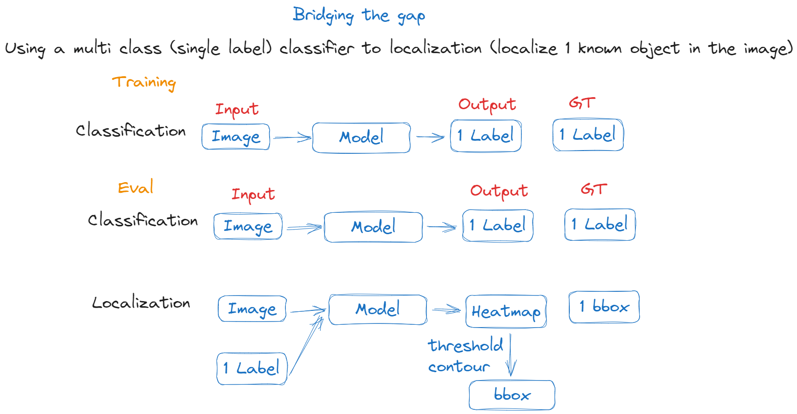

# A simple attempt to localize multiple objects in an image using original paper model

Date: 25/09/2023
Author: Trần Phú Vinh

## Introduction

Nhóm sử dụng model resnet50 được train theo config của bài báo
[Bridging the Gap between Classification and Localization
for Weakly Supervised Object Localization](https://arxiv.org/abs/2204.00220) để localize nhiều object trong ảnh.

## Method

Model được train 50/70 epoch theo config của bài báo.

Với mục tiêu có thể localize nhiều object trong ảnh, nhóm thực nghiệm như sau:

-   Gộp 4 ảnh ngẫu nhiên thuộc 4 class ngẫu nhiên từ tập CUB thành 1 ảnh.
-   Tiến hành cho ảnh qua model cùng với 4 label của 4 class đó.
-   Nếu heatmap của một lớp mà model đưa ra bao gồm các lớp còn lại thì chứng tỏ model bị sai và nhóm cần tiếp cận theo hướng khác.

## Result

-   Ở vài trường hợp, heatmap của các class khác label đưa vào không được kích hoạt.
-   Tuy nhiên, ở nhiều trường hợp, heatmap của các class khác label đưa vào vẫn được kích hoạt.

## Idea

Heatmap của class a kích hoạt tại vùng thuộc class a và class b. Nhưng heatmap của class b chỉ kích hoạt tại vùng thuộc class b. Điều này cũng có thể cho biết sự liên quan hoặc mức độ giống nhau của các class. Có thể khai thác điều này để giảm những vùng kích hoạt không cần thiết trong heatmap của một class.
